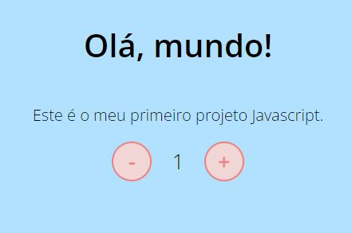
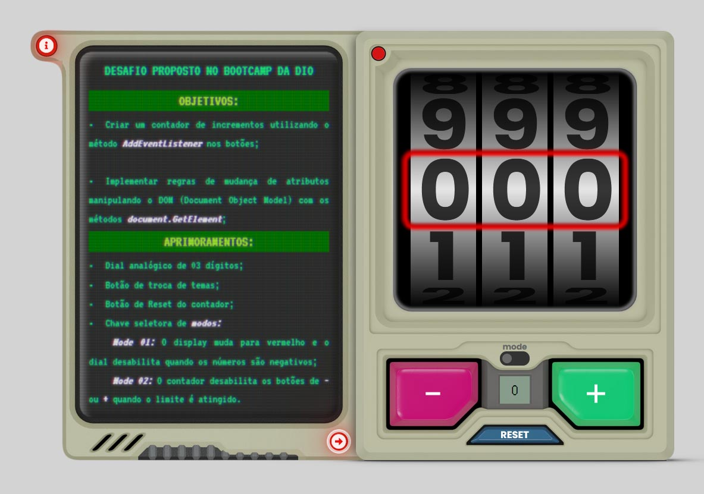
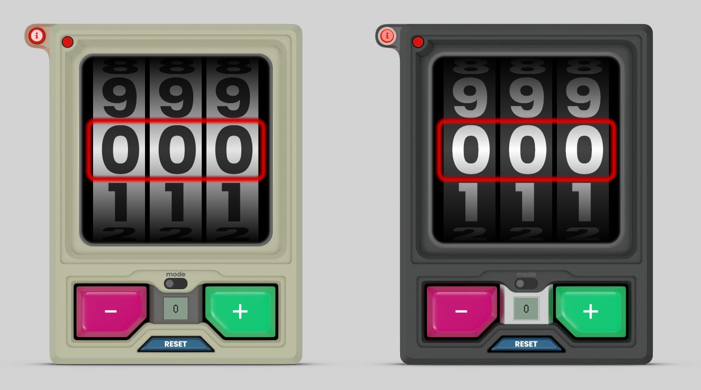
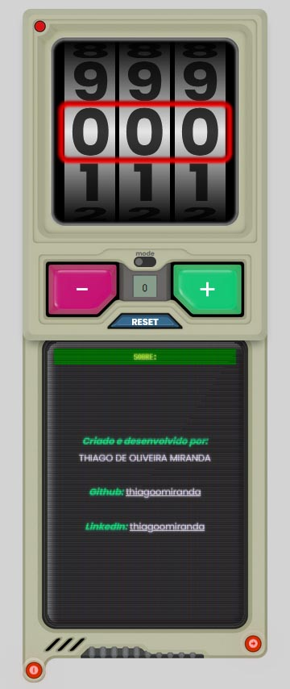

### **DESAFIO PROPOSTO NO BOOTCAMP DA DIO:**

<h2 align="center" color="red" >

***CONTADOR DE CLIQUES***

</h2>

<h3 align="center">

**Criado e desenvolvido por:** *Thiago de Oliveira Miranda*

</h3>

***

 

&emsp;&emsp;O desafio proposto consistia em criar um ***contador de cliques***, tendo como premissa a utilização e prática dos métodos ***AddEventListener*** nos botôes, sem o uso de das funções ***inline*** na página. 

&emsp;&emsp;O escopo também exigia a implementação de regras de manipulação de atributos dos elementos da página **DOM** (*Documento Object Model*) através dos métodos ***document.GetElement***.

 

***

### **Exercício apresentado:**

 

Figura 01: Contador

 

***

 

&emsp;&emsp;Parte importante e adicional da atividade é customizar o código, adicionando melhorias e características próprias com ênfase no aprendizado e na aplicação de novos métodos e funções do Javascript.

 

***

<h2 align="center">

  **MELHORIAS IMPLEMENTADAS**

</h2>

### **Resultado obtido:**

 

Figura 02: Side menu.

 

Figuras 03 e 04: Temas claro e escuro.
              

 

* [x]  Switch seletor de modos;
 
&emsp;&emsp;***Modo 01:*** O display muda para vermelho e o dial desabilita quando os números são negativos;
 
&emsp;&emsp;***Modo 02:*** O contador desabilita os botões de - ou + quando os limite mínimos e máximos são atingidos;
 
* [x]  Dial analógico de 03 dígitos, criado com atributos pseudo3D de CSS e HTML;           
* [x]  Botão de reset;
* [x]  Botão de seleção de temas;
* [x]  Efeitos sonoros nos botões;
* [x]  Submenu deslizante com informações e instruções;
* [x]  Sombras projetadas usando efeitos *after* de CSS;
* [x]  Responsividade para telas menores e dispositivos móveis;
* [x]  O design e a disposição dos botões muda para adequar a funcionalidade para tablets e celulares;
 

***

 

### **Submenu inferior:**

 

Figura 05: Design adaptado para dispositivos moveis.

              

 

***